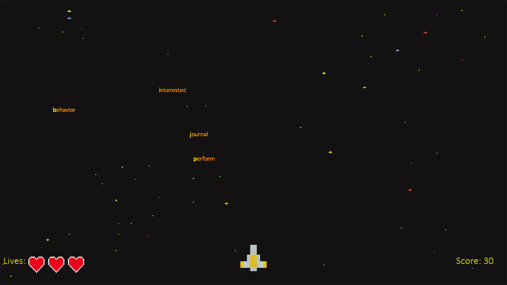

# Word-bomber-game
A simple word typing game built using pygame (Python)

## How to play
Word Bomber is a simple word typing game. Multiple words appear on the screen (moving downwards) from the top with some time interval between each other.
The player has to type the words correctly before they reach the bottom to earn points, else the player loses a life. The words appear in waves, with
the number of words increasing with each wave. After a certain number of lives are lost, the game ends. The player can choose to replay the game or quit.

## Requirements
* [Python3](https://www.python.org/downloads/)
* [pygame](https://www.pygame.org/docs/) (for game related operations): `pip install pygame`
* [cx_Freeze](https://cx-freeze.readthedocs.io/en/latest/) (for converting the game into an executable or an installer: `pip install cx_Freeze`
* You can also use [pyinstaller](https://pyinstaller.readthedocs.io/en/stable/) instead of cx_Freeze.

## Installation and Working

If you simply want to play the game (on Windows), you can either install the game using the **[.msi](https://github.com/ameyvadnere/Word-bomber-game/blob/main/Word%20Bomber-1.0-amd64-setup.msi)** installer provided, or you can directly go to **[game/exe.win-amd64-3.9](https://github.com/ameyvadnere/Word-bomber-game/tree/main/game/exe.win-amd64-3.9)** to find **wordbomber.exe**, which will launch the game.

For development (making changes to the game), you will first have to install the above dependencies. You can do this by running **[package-installer.bat](https://github.com/ameyvadnere/Word-bomber-game/blob/main/package-installer.bat)** (Windows) or **[package-installer.sh](https://github.com/ameyvadnere/Word-bomber-game/blob/main/package-installer.sh)** (Linux). You can also install the packages manually.

The main source file is **[wordbomber.py](https://github.com/ameyvadnere/Word-bomber-game/blob/main/wordbomber.py)**. You can make the necessary changes to this file and to run your game, simply run the script using `python wordbomber.py`.

Now, to convert your game into an executable file, run `python exec_maker.py build`. Make sure the game assets and all dependency files are included in **[exec_maker.py](https://github.com/ameyvadnere/Word-bomber-game/blob/main/exec_maker.py)**.
To convert your game into a Windows installer, run `python exec_maker.py bdist_msi`. For Mac and Linux platforms, please refer to the cx_Freeze [documentation](https://cx-freeze.readthedocs.io/en/latest/).

## Acknowledgements

* [Pygame Documentation](https://www.pygame.org/docs/)  
* [cx_Freeze Documentation](https://cx-freeze.readthedocs.io/en/latest/)  
* [Converting .py to .exe](https://pythonprogramming.net/converting-pygame-executable-cx_freeze/) 
* [Assets (background and rocket image)](https://www.youtube.com/redirect?event=video_description&redir_token=QUFFLUhqbXJwS0dnS2V4SHhoNXRBM1B1bzBtajRPcTgyUXxBQ3Jtc0ttNHRiMzFSSTgxTy1INmYtOGR6cmVrN2dURXc0bGM5RDBaUzVZQWRXdUk0Y1RLaWw4SWxsN1JMWDFiQmFlSURGTE9xTFY2YWVMZGRoMmRYVkxqanJ1XzZ4NFI1Ni1aZUp5a01sQU52dGxWWGJ5ZXZpSQ&q=https%3A%2F%2Ftechwithtim.net%2Fwp-content%2Fuploads%2F2020%2F04%2Fassets.zip)
* [Audio assets](https://mixkit.co/free-sound-effects/game/)
* [List of words used](https://www.ef.com/wwen/english-resources/english-vocabulary/top-3000-words/)
* [Stack Overflow (of course)](https://stackoverflow.com/)

